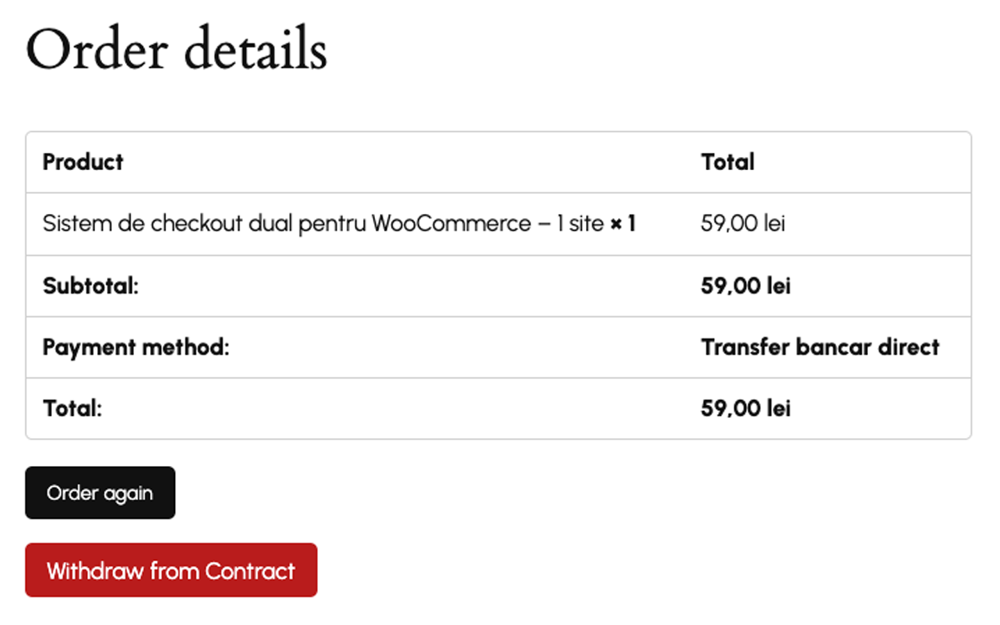
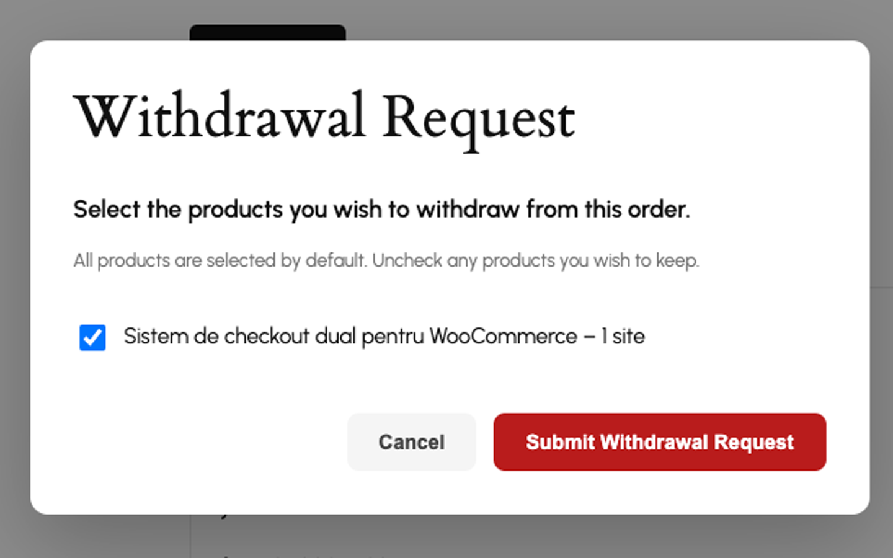
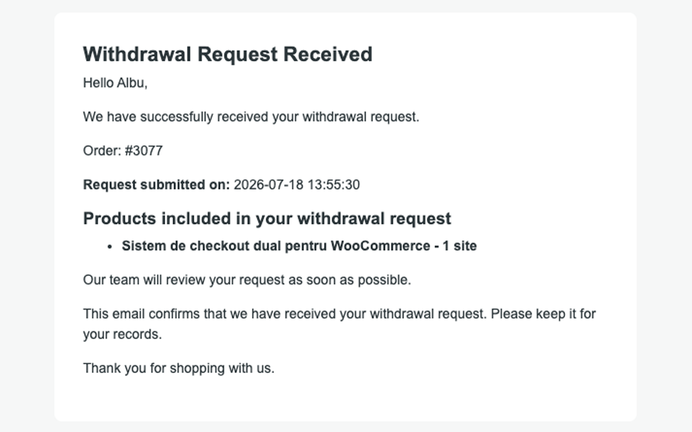
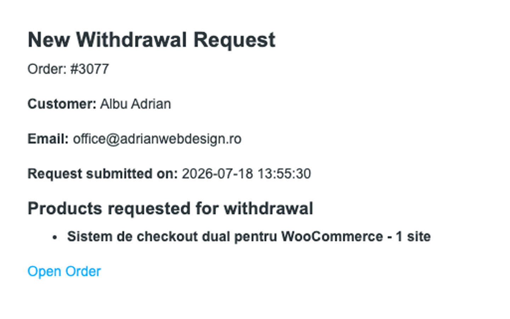
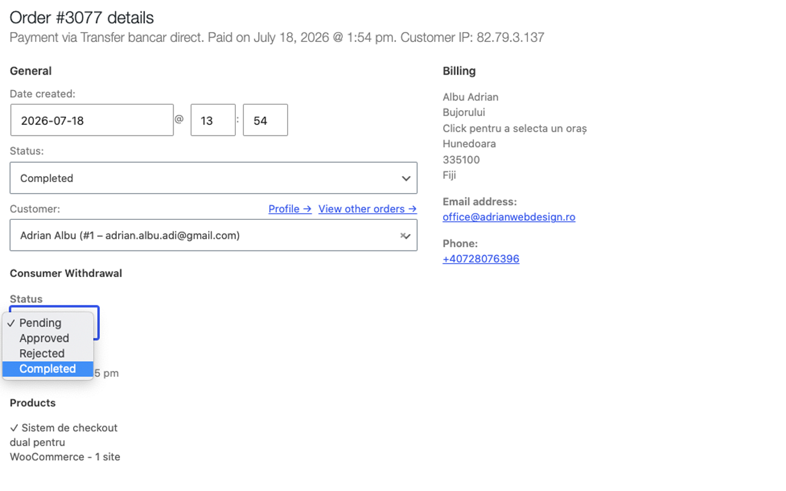
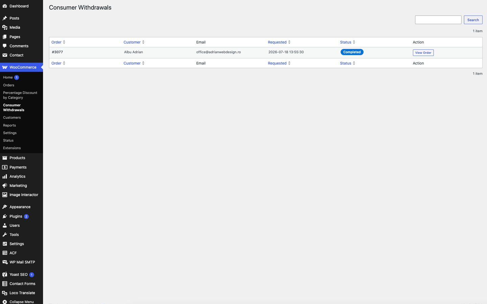

# Consumer Withdrawal for WooCommerce

<p align="center">
  
</p>

<p align="center">
A lightweight WooCommerce plugin that helps online stores comply with the European Union withdrawal function requirements by allowing customers to submit withdrawal requests directly from their WooCommerce account.
</p>

<p align="center">


</p>

---

# Why this plugin?

From **19 June 2026**, European legislation requires online interfaces concluding distance contracts with consumers to provide an online withdrawal function.

Consumer Withdrawal for WooCommerce allows store owners to implement this functionality in a familiar WooCommerce environment without modifying their checkout or customer workflow.

---

# Key Features

- ✅ Withdrawal button inside **My Account → Orders**
- ✅ Modern withdrawal request modal
- ✅ Product selection before submitting the request
- ✅ Automatic customer confirmation email
- ✅ Automatic administrator notification
- ✅ Withdrawal management directly inside WooCommerce orders
- ✅ Dedicated withdrawal requests dashboard
- ✅ AJAX powered
- ✅ Translation ready
- ✅ WooCommerce HPOS compatible
- ✅ Lightweight and easy to use

---

# Quick Overview

| Feature | Included |
|---------|:--------:|
| Withdrawal Button | ✅ |
| Product Selection | ✅ |
| Customer Email | ✅ |
| Administrator Email | ✅ |
| Withdrawal Dashboard | ✅ |
| HPOS Support | ✅ |
| Translation Ready | ✅ |
| AJAX | ✅ |
| Responsive | ✅ |

---

# Screenshots

## 1. Withdrawal button inside WooCommerce Orders

<p align="center">

</p>

The withdrawal button is automatically displayed for eligible WooCommerce orders.

---

## 2. Withdrawal request modal

<p align="center">

</p>

Customers can choose which products they wish to withdraw before submitting the request.

---

## 3. Customer confirmation email

<p align="center">

</p>

Automatic confirmation email sent immediately after the withdrawal request has been submitted.

---

## 4. Administrator notification

<p align="center">

</p>

The administrator receives a notification containing the customer details and selected products.

---

## 5. Manage withdrawal request

<p align="center">

</p>

Withdrawal requests can be managed directly from the WooCommerce order page.

---

## 6. Withdrawal requests dashboard

<p align="center">

</p>

Dedicated administration page for viewing and managing all withdrawal requests.

---

# Installation

1. Upload the plugin to:

```
wp-content/plugins/
```

or install it from the WordPress Plugins screen.

2. Activate the plugin.

3. The **Withdraw from Contract** button will automatically appear for eligible WooCommerce orders.

No additional configuration is required.

---

# Requirements

| Requirement | Version |
|-------------|---------|
| WordPress | 6.8 or later |
| WooCommerce | 10.0 or later |
| PHP | 7.4 or later |

---

# Compatibility

- ✅ WooCommerce HPOS
- ✅ WooCommerce Email System
- ✅ WooCommerce My Account
- ✅ AJAX
- ✅ Translation Ready
- ✅ Responsive

---

# Languages

Included translations:

- 🇺🇸 English
- 🇷🇴 Romanian
- 🇪🇸 Spanish

The plugin is fully translation ready.

---

# Roadmap

### Version 1.1

- Better filtering inside the withdrawal requests dashboard
- Additional administrator actions
- Improved email customization

### Version 1.2

- REST API support
- Export withdrawal requests
- Additional statistics

---

# Contributing

Pull requests are welcome.

If you have an idea for improving the plugin, please open an Issue before submitting a Pull Request.

---

# License

This plugin is licensed under the **GNU General Public License v2.0 or later (GPL-2.0-or-later).**

---

# Support

If this plugin helps your business, please consider giving the repository a ⭐.

Feedback, suggestions and contributions are always welcome.

---

<p align="center">

Made with ❤️ for the WooCommerce community.

</p>
